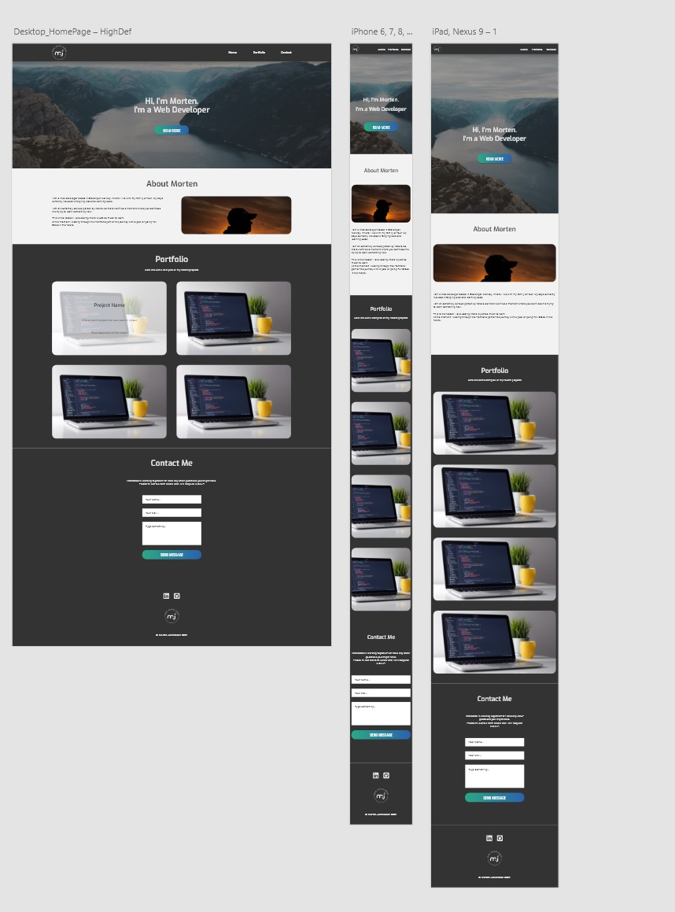

# Milestone Project One

## Morten Johansson || Personal Website

### Project Overview

This is my first milestone project for Code Institute's Full-stack Developer bootcamp.
For this project the requirements were to use only HTML and CSS(SASS for modular and file structure) to make the website.
Other technologies used: None

For this project I decided to make my own Website for my upcoming projects and past projects.
I will be a static website. It will be used as my own resume for job-hunting and acquiring potential freelance clients.

---

## UX

### Strategy Plane

Target audience

- Employeers
- Freelance Clients

User Needs

- User don't have the required knowledge to build a website themself
- User don't have time to invest to learning how to build a website
- User needs a new developer to join their team

What are they looking for?
Someone to help fill that possition or build out their vision for a website

Site Goals

- Build my online presence
- Show my work to clients and employers

---

## Scope Plane

### Features

#### Current implemented features:

Single page website containing:

- Hero section
- About section
- Portfolio section
- Contact section

About section:

- Information about site owner

Portfolio section:

- Grid of past projects
- each project has a preview picture of how the "front" page looks
- each project has a description of the project
- each project shows which technologies were used for that project

Contact Section:

- section of how to contact me

#### Features Left to Implement

Portfolio Section:

- Implement a modal for each project to popup on screen with full information about project(desktop only)

---

## Structure Plane

My website currently consists of a single page app with 4 sections. The structure is like this:

| Website           |
| ----------------- |
| Header Section    |
| Hero Section      |
| About Section     |
| Portfolio Section |
| Contact Section   |
| Footer            |

---

## Skeleton Plane

---

## Surface Plane

Typograhpy

The following fonts were used with this project:

- Exo
- Roboto

Colors

The following colors were used with this project:

- #F2F2F2 as background color with #3B3B3B as text for contrast purposes
- #333333 as alt background color with #E6E6E6 as text for contrast purposes
- Buttons have the gradient colors of #2AA885 to #2A62AE

Images

Hero Image was taken from https://unsplash.com/photos/GXT7AWP-03s Photo by Andrzej Kryszpiniuk
About picture taken from https://unsplash.com/photos/TEemXOpR3cQ Photo by Tracy Adams

---

## Technologies Used

- HTML5
  - For the structure of the site
- CSS3
  - For the styling of the site
- SASS
  - For modular code, nested rules, and all that make SASS awesome.
- JavaScript

  - For the hamburger menu functionality on mobile

- Git & GitHub

  - For version control

- Visual Studio Code
  - Text editor used to code out the site
- Adobe XD

  - For use in creating wireframes and mockup

- FontAwesome

  - For Icons used throughout the site

- CSS Tricks
  - For Grid & Flex consultation

## Testing

I tested this website through dev tools to check the responsiveness.
**Brosers**

- Chrome
- Firefox
- Microsoft Edge
- Safari for mobile

**Devices**

- Desktop
- Iphone 5/SE
- Iphone 6/7/8 as well as their plus version
- iPad/Ipad Pro
- Pixel 2/2XL
- Galaxy S5

During the testing I found no issues and it was responsive on all mentioned above.

---

**Contact Form**
During testing of the contact section I noticed the submit button sent users to the top of the page. Due to deadline constraint I did not find a solution to this problem and made the submit button into an inert button and will attemt to fix before a proper live launch of the site.

---

**HTML and CSS Validation**
I ran both HTML and the compiled sass and recieved no errors.

## Deployment

I hosted this website on GitHub Pages using these steps:

- Accessed my github page
- Accessed this projects Repository
- Accessed the settings panel
- Accessed the Pages section of the settings
- Under source i chose the main branch and the /root folder
- I clicked save
- And it was live

---

There are no difference between the deployed verion and the development version.

---

To run this project locally. Follow these steps:

- Access your github account
- Enter this adress: https://github.com/MortenJohansson/personal-website in the serch bar
- Click where it says in a green border "Code"
- You can either use the Git Clone function to clone the repository to your harddrive
- Or you can download it as a ZIP and extract it that way to your harddrive

## Credits

- Animating and Javascript for hamburger menu. From Coder Coder's youtube channel

### Media

- unsplash
- screenshots of my previously done projects for the Project section

### Acknowledgements

- Thanks to Effie Manyos for README inspiration
- Thanks to Adegbenga Adeye (Mentor)
